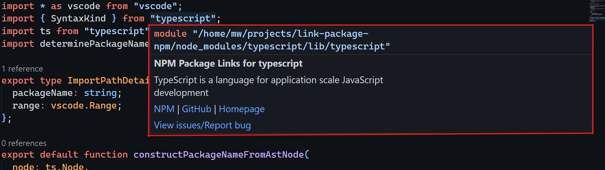
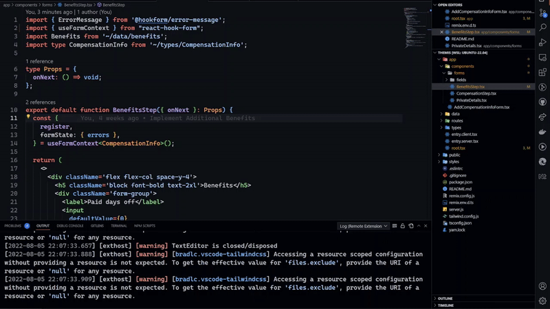

# NPM Imported Package Links - a VS Code Extension

[Download from Visual Studio Marketplace](https://marketplace.visualstudio.com/items?itemName=MainaWycliffe.view-package-on-npm)

## The Ultimate tool for Developers

This is the ultimate onboarding VS Code extension. When reading code, we
sometimes come across JS/TS packages that are unfamiliar, with this extension,
just hover on the imported package, and you will get information from NPM, about
the current version of the extension being used, with links to the NPM
package,Homepage and Git Repository.

> We are open to suggestions and PRs, feel free to open an issue or a PR.

## How it works

Hover on an imported npm package and wait as the package links are loaded,
as shown below 🤯🤯🤯🤯.

## Features

- Link to NPM
- Link to Git Remote Repository (GitHub, GitLab, BitBucket, etc.)
- Link to Homepage (Docs Site) - (Data from NPM - Homepage Settings)
- Link to Git Repository to view existing issues or report a bug
- Supports Javascript and Typescript (JSX/TSX variants as well)
- ES Modules imports Support
- Supports package.json
- Version and License information

## Roadmap

- Support version checks on package.json
- Support for frameworks that don't use Typescript or Javascript files i.e. Vue,
  Svelte, Astro, etc.
- Support CommonJS Modules

## Why

I created this extension to help developers get to important links for a package
all in one place. Want to learn more about a package being utilized in your
codebase, this extension will help you do that efficiently, no need to go
through Google.

## Contributing

PRs and suggestions are welcome
